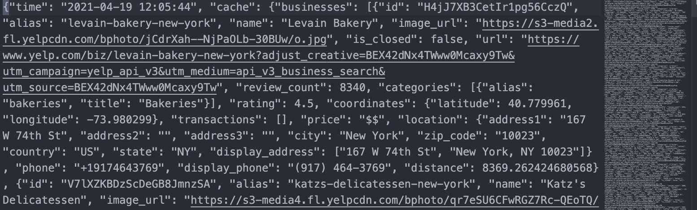
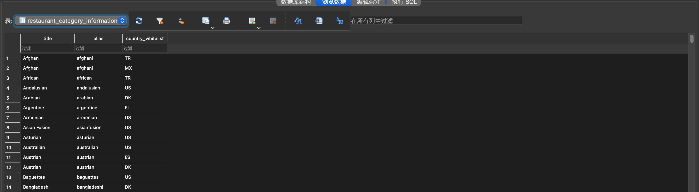
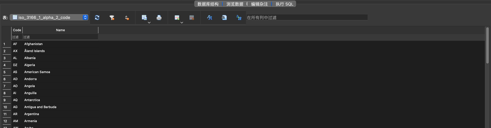
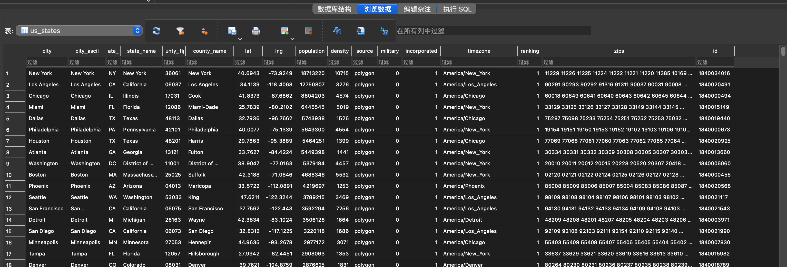
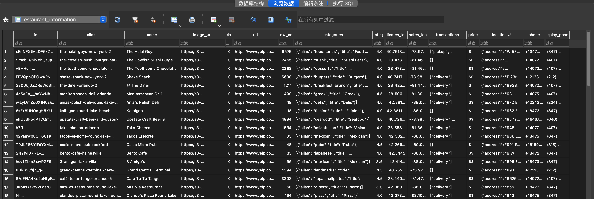
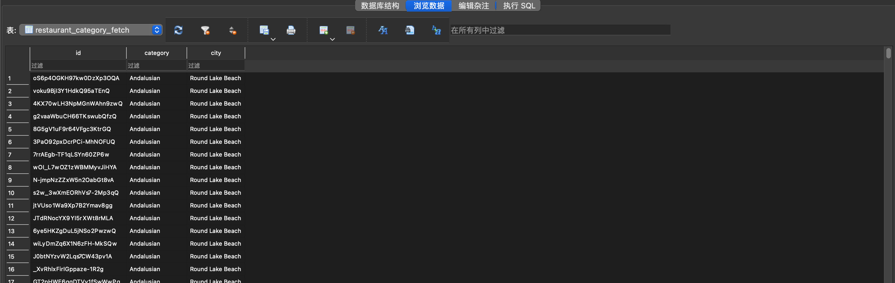
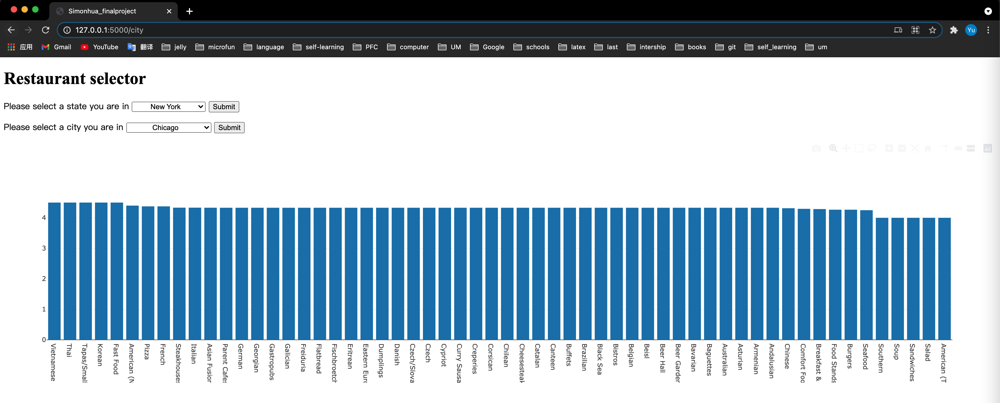

# Final Project Data CheckPoint

## Project code

https://github.com/Huadous/final-project

## Data sources

#### *Categories information*

1. **Origin** : [Documentation](https://www.yelp.com/developers/documentation/v3/all_category_list)  [Download](https://www.yelp.com/developers/documentation/v3/all_category_list/categories.json)

	

2. **Format** : JSON(> 1000 records)

3. **Data access and caching** : downloaded directly without additional verification methods, I used cache.

4. **Summary of data** : [$\approx 1500$ I will use 192]

  It contains information about categories and available countries. Therefore, this data can be used as a benchmark for restaurant category search. Because this is an all-category file, which contains not only the categories of restaurants. What I need to do is to filter out the category of the restaurant from all categories.

  **Important fields**:

  *   *"alias"* : alias of the child category, offer a different name for title.

  *   *"title"* : title of the child category and will be used to find different type of restaurant.

  *   *"parents"* : belongs to what parent category. The program use this to find which category belongs to restaurants.

  *   *"country_whitelist"* : available countries (without this field means TO ALL THE COUNTRIES)

5. **Evidence of caching **

	

	

#### *ISO 3166-1 alpha-2 code*

1. **Origin** : [Documentation](https://datahub.io/core/country-list)  [Download](https://datahub.io/core/country-list/r/data.json)

	

2. **Format** : JSON(< 1000 records)

3. **Data access and caching** : downloaded directly without additional verification methods, I used cache.

4. **Summary of data** :  [$\approx250$ I will use all of them]

  Because in the previous category file, there will be information about different restaurant categories in which countries provide search services. Therefore, it is necessary to use the abbreviations of the names of each country in this file to determine whether the restaurant in this category can be searched in the United States

  **Important fields** :

  *   *"Code"* : code of the country, this field is the same as the *"country_whitelist"* and improve its readability by providing the full name of the country.
  *   *"Name"* : name of the country, which is better for human reading.

5. **Evidence of caching **

  

  

#### *United States Cities Database*

1. **Origin**: [Documentation](https://simplemaps.com/data/us-cities) [Download](https://simplemaps.com/static/data/us-cities/1.73/basic/simplemaps_uscities_basicv1.73.zip)

	

2. **Format** : CSV ( >1000 records [$\approx 28000$])

3. **Data access and caching**: downloaded directly without additional verification methods. I used cache.

4. **Summary of data** : [28399 I will use all of them]

    The main usage of this data source is to provide an effective direct state-city relationship for the flask app. What's more, this data source have a very useful definition for city, city id, state and state id. I can use it as a mark for each city and state. 

    **Important fields**:

    *   "city" : name of the city.
    *   "city_ascii" : ascii version. This is more general, and I will use it as each city's name.
    *   "state_id" : abbreviation for state. This is more convenient than the *"state_name"* and can be used as a mark of the state.
    *   "state_name" : full state name.
    *   *"id"* : unique id for each city, which can be the primary key for each city in the database.

5. **Evidence of caching**

  

  

#### *Using API key to get base information and do analysis*

1. **Origin** : [Documentation](https://www.yelp.com/developers/documentation/v3/business_search)  Request : `GET https://api.yelp.com/v3/businesses/search`

	

2. **Format** : JSON ( Each request can only get up to 50 results. you still can only get up to 1000 results using multiple queries and combinations of the "limit" and "offset" parameters)

3. **Data access and caching** : The Yelp Fusion API uses private key authentication to authenticate all endpoints. I used cache.

4. **Summary of data** : [I will use [50, 1000] for each category of restaurant]

    What I'm trying to get from this API is the data of different categories of restaurants. Each request can get up to 50 results. In order to make the flask app faster, I decided to let each type of category of the restaurant only gets 50 records at most to draw the average rating bar plot. There are approximately 200 types of restaurants available in yelp in the US. Then, each plot needs nearly 10000 records of restaurants(The restaurant may not be completely unique, because the restaurant may have more than one category)

    **Important fields** :

    *   *"total"* : Total number of business Yelp finds based on the search criteria. 
    *   *"businesses"* : List of business Yelp finds based on the search criteria.
        *   *"categories"* : List of category title and alias pairs associated with this business.
        *   *"coordinates"* : Coordinates of this business.
        *   *"id"* : Unique Yelp ID of this business. Example: `'4kMBvIEWPxWkWKFN__8SxQ'`
        *   *"name"* : Name of this business.
        *   *"rating"* : Rating for this business (value ranges from 1, 1.5, ... 4.5, 5).

5. **Evidence of caching**

  

  

#### *Crawling and scraping multiple pages in Yelp to gain information related covid-19*

1. **Origin** : website : `https://www.yelp.com/`

	

2. **Format** : Html

3. **Data access and caching** : By crawling and scraping. I used cache.

4. **Summary of data** : [I will use [50, 1000] for each category of restaurant]

    This part of the data is not fixed, each restaurant has its own services dealing with covid-19. There are some basic services provided by yelp. However, the user and also the owner of the restaurant can change the information on the website. I'm trying to get all of the services from the site and provide it in my flask app to the users.

    **Important attributes** :

    *   *"Updated Services"* : some basic services the restaurant can provide to the customer.
    *   *"Health & Safety Measures"* : what the health & satety measures the restaurant has implemented. 

5. **Evidence of caching**

  

  

## Database

#### *Database schema*

```sqlite
CREATE TABLE IF NOT EXISTS restaurant_category_information(
"title"	TEXT NOT NULL, # name of the category
"alias"	TEXT NOT NULL, # alias of the name
"country_whitelist"	TEXT # Which countries offer searches in this category);
```

It contains all the restaurant categories (not all the categories provided by yelp fusion)

```sqlite
CREATE TABLE IF NOT EXISTS iso_3166_1_alpha_2_code(
"Code"	TEXT NOT NULL, # ISO 3166-1 alpha-2 code
"Name"	TEXT NOT NULL, # English short name officially used by the ISO 3166
      	PRIMARY KEY("Code"));
```

ISO 3166-1 alpha-2 codes are two-letter country codes defined in ISO 3166-1, part of the ISO 3166 standard published by the International Organization for Standardization (ISO), to represent countries, dependent territories, and special areas of geographical interest. This form is suitable for filtering which categories are available in which countries (although my program is only used in the United States).

```sqlite
CREATE TABLE IF NOT EXISTS us_states(
"city"	TEXT, # name of the city
"city_ascii"	TEXT, # ascii of the name of the city
"state_id"	TEXT, # alpha2 of the state (`'NY'` for New York)
"state_name"	TEXT, # name of the state (New York)
"county_fips"	TEXT,
"county_name"	TEXT,
"lat"	REAL,
"lng"	REAL,
"population"	INTEGER,
"density"	INTEGER,
"source"	TEXT,
"military"	INTEGER,
"incorporated"	INTEGER,
"timezone"	TEXT,
"ranking"	INTEGER,
"zips"	TEXT,
"id"	TEXT, # unique id for each city
PRIMARY KEY("id"));
```

The purpose of this form is to help users select a certain city in a certain state, and then facilitate the flask application to continue to deal with subsequent statistical problems of different categories of restaurant ratings. You can see it from the pic in the *Interaction and Presentation Plans* part. Because location is needed when searching, all the location is associated with the search record table (restaurant_category_fetch).

```sqlite
CREATE TABLE IF NOT EXISTS restaurant_information(
"id"	TEXT, # id of each restaurant 
"alias"	TEXT, # alias of the restaurant
"name"	TEXT, # name of the restaurant
"image_url"	TEXT, # url of the image of the restaurant  
"is_closed"	INTEGER, # whether is closed
"url"	TEXT, # url in yelp
"review_count"	INTEGER,
"categories"	TEXT,
"rating"	REAL,
"coordinates_latitude"	REAL,
"coordinates_longitude"	REAL,
"transactions"	TEXT,
"price"	TEXT,
"location"	TEXT,
"phone"	TEXT,
"display_phone"	TEXT,
PRIMARY KEY("id"));
```

This table is used to record restaurant information. Through the search api provided by yelp fusion, information related to the search results can be collected. I will store the restaurant information obtained by each search in the database, because restaurant information is not frequently updated data. 

```sqlite
CREATE TABLE IF NOT EXISTS restaurant_category_fetch (
"id"	TEXT NOT NULL, # id of restaurant(the same as restaurant_information.id)
"category"	TEXT NOT NULL, # searched category(the same as us_states.city_ascii)
"city" TEXT NOT NULL # searched city(the same as restaurant_category_information.title));
```

This is a table that records each search, which contains necessary information including location, category, and returned shop id. They are respectively associated with the three tables, please see the follow-up for details. This table may change in the future, or there is another table to filter the information of the categories of valid stores.

#### *Foreign key-primary key relations*

```sqlite
1. restaurant_category_information.country_whitelist = iso_3166_1_alpha_2_code.Code
2. restaurant_category_fetch.id = restaurant_information.id
3. restaurant_category_fetch.city = us_states.city_ascii
4. restaurant_category_fetch.category = restaurant_category_information.title
```


#### *Screenshots of the data*

*   Table 1 : restaurant_category_information

    

*   Table 2 : iso_3166_1_alpha_2_code

    

*   Table 3 : us_states

    

*   Table 4 : restaurant_information

    

*   Table 5 : restaurant_category_fetch

    

## Interaction and Presentation Plans

####  *Description*

A program that lets a user choose a specific state and a city and see the average ratings for different restaurant types from Yelp as **plotly bar**.  You can see it from the pic below. However, This is only a draft version and not the final version.You can select a state at first and submit, then a city and submit. The program will generate the bar plot by the state and the city you provided.



Then, you can choose a specific type of food, the program will present a useful statistical information about the covid-19 and specific restaurant information presented in a **table** to help you decide where to go. I will only show some useful information in the table.

The program will also provide a **plot of map** to facilitate you to choose a location closer to you. I intend to generate a map information from the address of each restaurant, so that users can roughly get the location of each restaurant. Specific information can be viewed by entering the detailed information of the restaurant.

Finally, you can choose one restaurant specifically, the program will offer you more details in **text**. This part will contain as much information as I can provide. 

#### *Technologies*

1.  **Flask ** : The whole program is running within a Flask App. 
2.  **Plotly** : I used plotly to draw bar plot. There are some statistic data for covid 19 I can use.
3.  **Command line **: Only for logging, you can see what the flask app is doing from the command line.