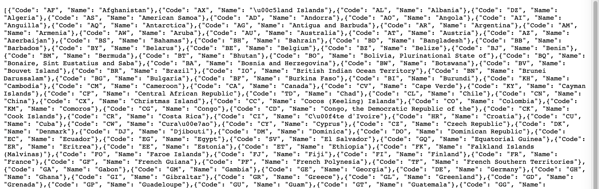

# Final Project Data CheckPoint


## Project code

https://github.com/Huadous/final-project


## Data sources

***Categories information***

1. Origin

	[Documentation](https://www.yelp.com/developers/documentation/v3/all_category_list)

	[Download](https://www.yelp.com/developers/documentation/v3/all_category_list/categories.json)

	

2. Format

	JSON( > 1000 records [$\approx 1500$])

3. Data access and caching

	The file can be downloaded directly without additional verification methods, I used cache.

4. Summary of data

	The function of this file is that it contains information about the types of restaurants, and it also provides information for which countries are searchable. Therefore, the category data file can be used as a benchmark for restaurant category search. Because this is an all-category file, which contains not only the categories of restaurants. What I need to do is to filter out the category information of the restaurant from all categories.

	There are about 1,500 categories in this file. I need to download all of them and filter out the restaurant categories. The category of the restaurant is 192.

5. Evidence of caching 

	code :

	

	snapshot :	


***ISO 3166-1 alpha-2 code***

1. Origin

	[Documentation](https://datahub.io/core/country-list)

	[Download](https://datahub.io/core/country-list/r/data.json)

	

2. Format

	JSON( < 1000 records [$\approx250$])

3. Data access and caching

	The file can be downloaded directly without additional verification methods, I used cache.

4. Summary of data

	Because in the previous category file, there will be information about different restaurant categories in which countries provide search services. Therefore, it is necessary to use the abbreviations of the names of each country in this file to determine whether the restaurant in this category can be searched in the United States, which can reduce the time wasted due to unnecessary searches, especially in the case of a bad network important.

5. Evidence of caching 

	code : 

	

	snapshot : 

	


***United States Cities Database***

1. Origin

	[Documentation](https://simplemaps.com/data/us-cities)

	[Download](https://simplemaps.com/static/data/us-cities/1.73/basic/simplemaps_uscities_basicv1.73.zip)

	

	

2. Format

	CSV ( >1000 records [$\approx 28000$])

3. Data access and caching

	The file can be downloaded directly without additional verification methods, I also add it into the source file and will provide it with my program together. I used cache.

4. Summary of data

5. Evidence of caching

	code :

	

	snapshot :

	


***Using API key to get base information and do analysis***

1. Origin

	[Documentation](https://www.yelp.com/developers/documentation/v3/business_search)

	Request : `GET https://api.yelp.com/v3/businesses/search`

	Mine : 

	

	Offical website :

	

2. Format

	JSON ( Each request can only get up to 50 results. you still can only get up to 1000 results using multiple queries and combinations of the "limit" and "offset" parameters)

3. Data access and caching

	The Yelp Fusion API uses private key authentication to authenticate all endpoints. I used cache.

4. Summary of data

5. Evidence of caching

	code :

	

	snapshot :

	


​	

***Crawling and scraping multiple pages in Yelp to gain information related covid-19***

1. Origin

	website : `https://www.yelp.com/`

	

2. Format

	Html

3. Data access and caching

	By crawling and scraping. I used cache.

4. Summary of data

5. Evidence of caching

	code : (this part still used the old type of caching, I will change it like what I used in the code above)

	

	


## Database

***Database schema***

* Table 1 : restaurant_category_information

```sqlite
CREATE TABLE IF NOT EXISTS restaurant_category_information(
				"title"	TEXT NOT NULL,
				"alias"	TEXT NOT NULL,
      	"country_whitelist"	TEXT
);
```

* Table 2 : iso_3166_1_alpha_2_code

```sqlite
CREATE TABLE IF NOT EXISTS iso_3166_1_alpha_2_code(
				"Code"	TEXT NOT NULL,
				"Name"	TEXT NOT NULL,
      	PRIMARY KEY("Code")
);
```

* Table 3 : us_states

```sqlite
CREATE TABLE IF NOT EXISTS us_states(
				"city"	TEXT,
				"city_ascii"	TEXT,
				"state_id"	TEXT,
				"state_name"	TEXT,
				"county_fips"	TEXT,
				"county_name"	TEXT,
				"lat"	REAL,
				"lng"	REAL,
				"population"	INTEGER,
				"density"	INTEGER,
				"source"	TEXT,
				"military"	INTEGER,
				"incorporated"	INTEGER,
				"timezone"	TEXT,
				"ranking"	INTEGER,
				"zips"	TEXT,
				"id"	TEXT,
				PRIMARY KEY("id")
);
```

* Table 4 : restaurant_information

```sqlite
CREATE TABLE IF NOT EXISTS restaurant_information(
				"id"	TEXT,
				"alias"	TEXT,
				"name"	TEXT,
				"image_url"	TEXT,
				"is_closed"	INTEGER,
				"url"	TEXT,
				"review_count"	INTEGER,
				"categories"	TEXT,
				"rating"	REAL,
				"coordinates_latitude"	REAL,
				"coordinates_longitude"	REAL,
				"transactions"	TEXT,
				"price"	TEXT,
				"location"	TEXT,
				"phone"	TEXT,
				"display_phone"	TEXT,
				PRIMARY KEY("id")
);
```

* Table 5 : restaurant_category_fetch

```sqlite
CREATE TABLE IF NOT EXISTS restaurant_category_fetch (
				"id"	TEXT NOT NULL,
				"category"	TEXT NOT NULL,
				"city" TEXT NOT NULL
);
```


***Foreign key-primary key relations***

```sqlite
1. restaurant_category_information.country_whitelist = iso_3166_1_alpha_2_code.Code

2. restaurant_category_fetch.id = restaurant_information.id

3. restaurant_category_fetch.city = us_states.city_ascii

4. restaurant_category_fetch.category = restaurant_category_information.title
```


#### Interaction and Presentation Plans

