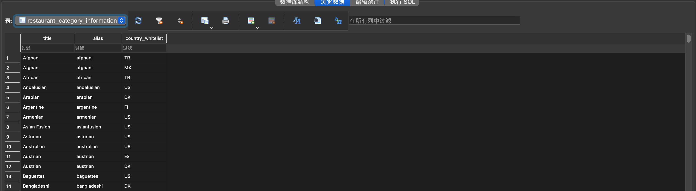
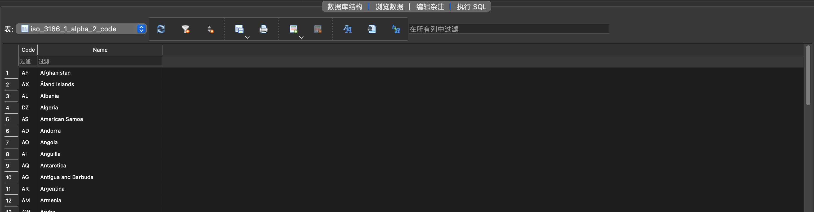
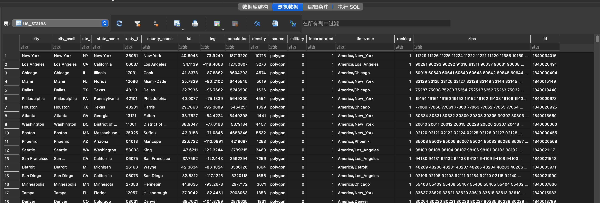

# Final Project

## Project code

*   **Github repo link:** https://github.com/Huadous/final-project

*   **README**

    This program mainly uses the API provided by Yelp Fusion. The **API verification key** is also very easy to apply, please apply through this link: https://www.yelp.com/fusion. Sign up for an account and manage apps on the website which will contain an API Key. You need to create a file named `secrets.py` and copy this variable into the file `API_KEY = 'your_api_key'`.

    The entire app is built within the **flask** framework, and the human-computer interaction is relatively simple. The main thing is to use the **three drop-down menus** to select the state, the city in state, and the available restaurant categories. After selecting the state and city, statistical information about different categories will be displayed. Then you can choose your favorite restaurant category based on them. At this time, the information of the restaurants in that category will be displayed in the form of a table, or you can click the **Map button** to display the location of the restaurants. In the table, you can click the **"Click here" button** to enter the detailed information page of the restaurant.

*   **Required Python packages**

    requests, plotyly, folium, pandas, flask and bs4.

## Data sources

### Categories information

*   **Origin:** [Documentation](https://www.yelp.com/developers/documentation/v3/all_category_list)  [Download](https://www.yelp.com/developers/documentation/v3/all_category_list/categories.json)  **Format:** JSON$\text{(> 1000 records)}[\approx\text{1500}]\{192\text{ used}\}$
*   **Data access and caching:** downloaded directly without additional verification methods, I used cache.
*   **Summary of data:** It contains information about categories and available countries. Then, this data can be used as a benchmark for restaurant category search. Because this file contains all the categories. What I need to do is to filter out the category of restaurants from all categories.
*   **Important fields:** ***"alias":*** alias of the child category, offer a different name for title. ***"title":*** title of the child category and will be used to find different type of restaurant. ***"parents":*** belongs to what parent category. ***"country_whitelist":*** available countries (without this field means **TO ALL THE COUNTRIES**).

### ISO 3166-1 alpha-2 code

*   **Origin:** [Documentation](https://datahub.io/core/country-list)  [Download](https://datahub.io/core/country-list/r/data.json)  **Format:** JSON$\text{(< 1000 records)}[\approx\text{250}]\{250\text{ used}\}$
*   **Data access and caching:** Downloaded directly without additional verification methods, I used cache.
*   **Summary of data:** Because in the previous category file, there are information about different restaurant categories in which countries provide search services. Therefore, it is necessary to use the abbreviations of the names of each country in this file to determine whether this category can be searched in the US.
*   **Important fields:** ***"Code":*** code of the country and improve its readability by providing the full name of the country. ***"Name":*** name of the country, which is better for human reading.

### United States Cities Database

*   **Origin:** [Documentation](https://simplemaps.com/data/us-cities)  [Download](https://simplemaps.com/static/data/us-cities/1.73/basic/simplemaps_uscities_basicv1.73.zip)  **Format:** CSV$\text{(> 1000 records)}[\approx\text{28000}]\{28399\text{ used}\}$
*   **Data access and caching:** downloaded directly without additional verification methods. I used cache.
*   **Summary of data:** The main usage of this data source is to provide an effective state-city relationship for the flask app. What's more, this data source have a very useful definition for city, city id, state and state id. I can use it as a mark for each city and state.
*   **Important fields:** ***"city":*** name of the city. ***"city_ascii":*** ascii version. This is more general, and I will use it as each city's name. ***"state_id":*** abbreviation for state. It is more convenient as a mark of the state. ***"state_name":*** full state name. ***"id":*** unique id for each city, which can be the primary key for each city in the database.

### Using API key to get base information and do analysis

*   **Origin:** [Documentation](https://www.yelp.com/developers/documentation/v3/business_search)  **Format:** JSON$\text{(> 1000 records)}[\approx\infty]\{[50,1000]\text{ for each type will be used}\}$

    `GET https://api.yelp.com/v3/businesses/search` ( Each request can only get up to 50 results. you still can only get up to 1000 results using multiple queries and combinations of the "limit" and "offset" parameters)

*   **Data access and caching** : The Yelp Fusion API uses private key to authenticate. I used cache.

*   **Summary of data** : What I'm trying to get from this API is the data of different categories of restaurants. Each request can get up to 50 results. In order to make the flask app faster, I decided to let each type of category of the restaurant only gets 50 records at most to draw the average rating bar plot. There are approximately 200 types of restaurants available in yelp in the US. Then, each plot needs nearly 10000 records of restaurants(The restaurant may not be completely unique, because the restaurant may have more than one category)

*   ***Important fields in "businesses":*** ***"categories:"*** List of category title and alias pairs associated with this business.  ***"id":*** Unique Yelp ID of this business. Example: `'4kMBvIEWPxWkWKFN__8SxQ'`. ***"name":*** Name of this business. ***"rating":*** Rating for this business. ***"coordinates":*** Coordinates of this business.

### Crawling and scraping multiple pages in Yelp to gain information related covid-19

*   **Origin:** https://www.yelp.com/  **Format:** HTML$[\approx\infty]\{[50,1000]\text{ for each type will be used}\}$
*   **Data access and caching:** By crawling and scraping. I used cache.
*   **Summary of data:** This part is not fixed, each restaurant has its own services dealing with covid-19. There are some basic services provided by yelp. But, the user and the owner of the restaurant can change the information on the webpage. I will get all of them from the site and provide it in my flask app to the users.
*   **Important attributes:** ***"Updated Services":*** some basic services the restaurant can provide to the customer. ***"Health & Safety Measures:"*** what the health & satety measures the restaurant has implemented. 

## Database

#### *Database schema*

```sqlite
CREATE TABLE IF NOT EXISTS restaurant_category_information(
"title"	TEXT NOT NULL, # name of the category
"alias"	TEXT NOT NULL, # alias of the name
"country_whitelist"	TEXT # Which countries offer searches in this category);
```

It contains all the restaurant categories (not all the categories provided by yelp fusion)

```sqlite
CREATE TABLE IF NOT EXISTS iso_3166_1_alpha_2_code(
"Code"	TEXT NOT NULL, # ISO 3166-1 alpha-2 code
"Name"	TEXT NOT NULL, # English short name officially used by the ISO 3166
      	PRIMARY KEY("Code"));
```

ISO 3166-1 alpha-2 codes are two-letter country codes defined in ISO 3166-1, part of the ISO 3166 standard published by the International Organization for Standardization (ISO), to represent countries, dependent territories, and special areas of geographical interest. This form is suitable for filtering which categories are available in which countries (although my program is only used in the United States).

```sqlite
CREATE TABLE IF NOT EXISTS us_states(
"city"	TEXT, # name of the city
"city_ascii"	TEXT, # ascii of the name of the city
"state_id"	TEXT, # alpha2 of the state (`'NY'` for New York)
"state_name"	TEXT, # name of the state (New York)
"county_fips"	TEXT,
"county_name"	TEXT,
"lat"	REAL,
"lng"	REAL,
"population"	INTEGER,
"density"	INTEGER,
"source"	TEXT,
"military"	INTEGER,
"incorporated"	INTEGER,
"timezone"	TEXT,
"ranking"	INTEGER,
"zips"	TEXT,
"id"	TEXT, # unique id for each city
PRIMARY KEY("id"));
```

The purpose of this form is to help users select a certain city in a certain state, and then facilitate the flask application to continue to deal with subsequent statistical problems of different categories of restaurant ratings. You can see it from the pic in the *Interaction and Presentation Plans* part. Because location is needed when searching, all the location is associated with the search record table (restaurant_category_fetch).

```sqlite
CREATE TABLE IF NOT EXISTS restaurant_information(
"id"	TEXT, # id of each restaurant 
"alias"	TEXT, # alias of the restaurant
"name"	TEXT, # name of the restaurant
"image_url"	TEXT, # url of the image of the restaurant  
"is_closed"	INTEGER, # whether is closed
"url"	TEXT, # url in yelp
"review_count"	INTEGER,
"categories"	TEXT,
"rating"	REAL,
"coordinates_latitude"	REAL,
"coordinates_longitude"	REAL,
"transactions"	TEXT,
"price"	TEXT,
"location"	TEXT,
"phone"	TEXT,
"display_phone"	TEXT,
PRIMARY KEY("id"));
```

This table is used to record restaurant information. Through the search api provided by yelp fusion, information related to the search results can be collected. I will store the restaurant information obtained by each search in the database, because restaurant information is not frequently updated data. 

```sqlite
CREATE TABLE IF NOT EXISTS restaurant_category_fetch (
"id"	TEXT NOT NULL, # id of restaurant(the same as restaurant_information.id)
"category"	TEXT NOT NULL, # searched category(the same as us_states.city_ascii)
"city" TEXT NOT NULL # searched city(the same as restaurant_category_information.title));
```

This is a table that records each search, which contains necessary information including location, category, and returned shop id. They are respectively associated with the three tables, please see the follow-up for details. This table may change in the future, or there is another table to filter the information of the categories of valid stores.

#### *Foreign key-primary key relations*

```sqlite
1. restaurant_category_information.country_whitelist = iso_3166_1_alpha_2_code.Code
2. restaurant_category_fetch.id = restaurant_information.id
3. restaurant_category_fetch.city = us_states.city_ascii
4. restaurant_category_fetch.category = restaurant_category_information.title
```


#### *Screenshots of the data*

*   Table 1 : restaurant_category_information

    

*   Table 2 : iso_3166_1_alpha_2_code

    

*   Table 3 : us_states

    

*   Table 4 : restaurant_information

    

*   Table 5 : restaurant_category_fetch

    

## Interaction and Presentation Options

###  Description

The program allows users to select specific states and cities, and view the average ratings of different restaurant types from the bar graph. You can first select a state and submit, and then select a city and submit. The program will generate bar graphs based on the state and city you provide. It contains two **bar graphs**, the first is the average rating, and the second is the statistics of each type of restaurant

Then, you can choose a specific type of food, the program will present useful information about the covid-19 (including updated services and health & safety measures)and specific restaurant information presented in a **table** to help you decide where to go. I will only show some useful information in the table(including name, image, url, and rating). The program will also provide a **plot of map** to facilitate you to choose a location closer to you. You can click the  Map button to switch the table to the map.

Finally, you can choose one restaurant specifically, the program will offer you more details in **text**. This part will contain many details for each store. The URL is also provided if you want to make an order or see more details on the yelp webpage.

Besides the flask app, I also provide the **logging information** in the command line. You can know what exactly the flask app is doing from the command line. This including several types: database, cache, yelp_covid, yelp_fusion, CSV, and flask. Each of them represents a specific python module and you can easily figure out the relationship.

### Technologies

*   **Flask:** The whole program is running within a Flask App. 
*   **Plotly:** I use plotly to draw bar plot. There are some statistic data for covid 19 I can use.
*   **Folium:** This is a map package, I use it to draw a map to show the locations of the restaurants.
*   **Command line:** Only for logging, you can see what the flask app is doing from the command line.

### Brief instructions


## Demo Link

